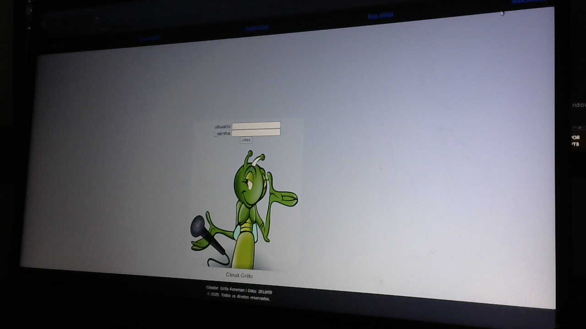
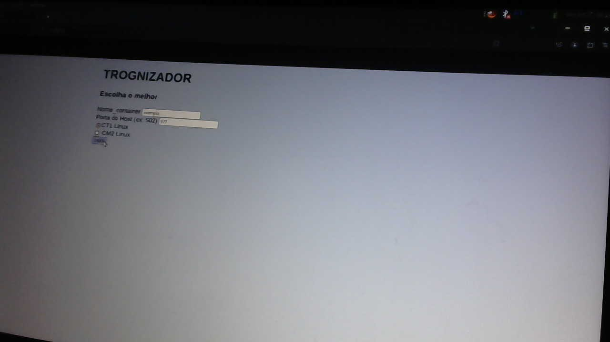
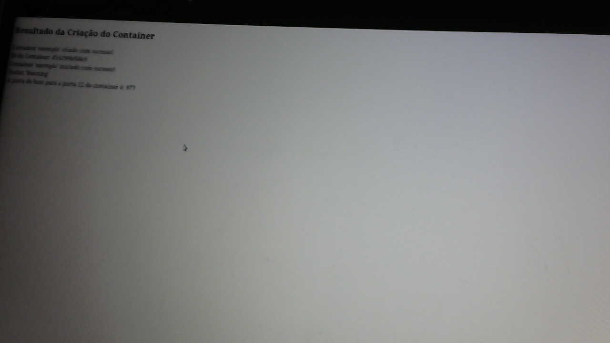
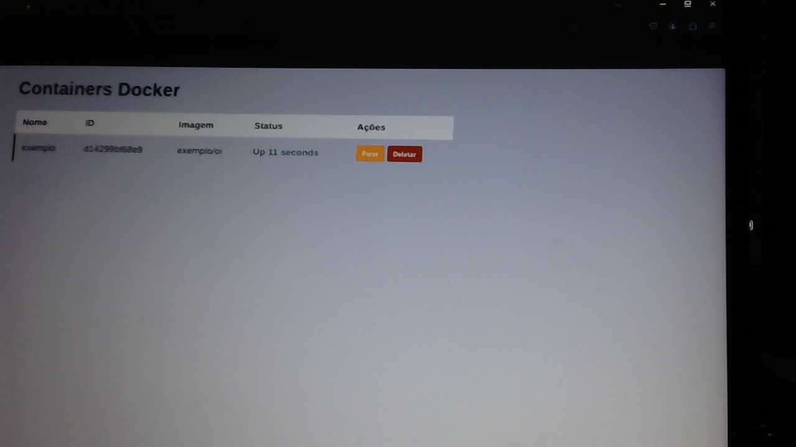
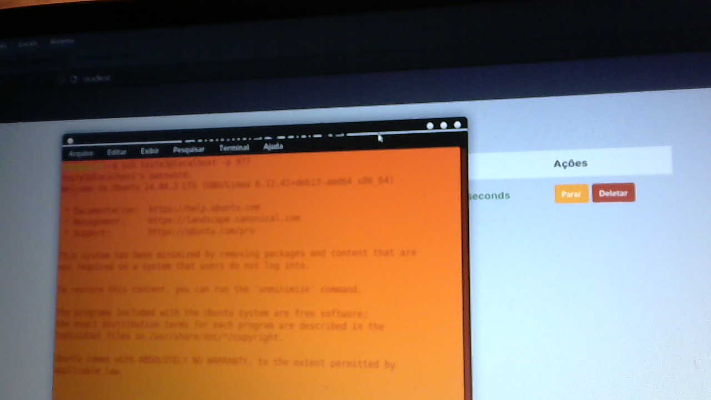

# GRIllOCloud

Este projeto está em desenvolvimento.  
O que está disponível atualmente no Git é apenas um MVP — uma versão 
básica com o objetivo de demonstrar o funcionamento inicial da aplicação.

Mais recursos serão incluídos futuramente, como:

- Gerenciamento de sessões  
- Painel de configuração  
- Suporte à escolha da versão do Docker SDK  

⚙️ **Importante:**  
Para que o sistema funcione corretamente,  
é necessário configurar a versão do Docker SDK utilizada.  

Essa escolha impacta diretamente a URL de chamada,  
pois diferentes versões exigem ajustes específicos
 na estrutura da requisição.

## 🛠 DICAS INSTALACAO

O projeto para funcionar precisa do php e umn
sgbd a escolha e de cada um sobre o que usar,
mais o projeto usou mysql, voce tem que criar
no servidor web uma bastas e incluir o projeto
no caso rodou com apache, mais voce pode usar outro
basta saber usar, o php foi 7 e superior.

Em relacao imagem do docker voce vai baixar uma
do ubuntu, voce pode usar o Dockerfile que existe
que ja está com todas as configuraões necessarias.

O usuario da imagem é o "teste3" e a senha "teste".
Depois de criar usando o sistema voce acessa
por ssh.
Exemplo:

$ssh teste3@localhsot -p portas escolhida

Para criar a imagem que foi modificada para o projeto.
$ docker build -t nome-da-imagem .

O nome da imagem criada tem que ser de acordo com o 
código pois tem que ser chammada.

---

## 🛠 Tecnologias utilizadas

- PHP  
- SOLID (princípios de arquitetura)  
- MVC (Model-View-Controller)  
- CRUD (Create, Read, Update, Delete)  
- SQL  
- FNs (funções reutilizáveis)  
- HTML5  
- CSS  
- docker
- API
- SSH
- composer

---

Se quiser que eu adicione instruções de instalação, estrutura
 de diretórios ou exemplos de uso, posso complementar esse 
README para você!

